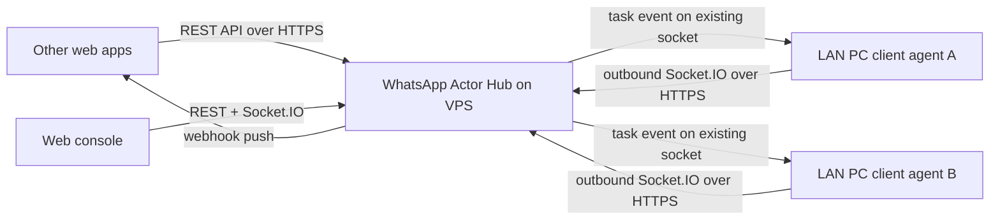

# WhatsApp Actor Hub

一个用于调度多台内网 WhatsApp client 的 actor hub。推荐部署方式是：Hub 放在公网 VPS，所有内网电脑上的 WhatsApp client agent 主动连出到 VPS Hub。VPS 不需要反向访问内网机器。

`whatsapp-web.js` 是 WhatsApp Web 的非官方 API，生产环境需要自行评估 WhatsApp 风控、封号、隐私和合规风险。

## 架构



## 功能

- 动态注册、删除、查看 WhatsApp clients。
- 根据在线状态调度指定 client 或随机在线 client。
- 发送消息任务状态：`queued`、`running`、`succeeded`、`failed`。
- client 收到消息后上报 hub，支持按 client、sender、chat 查询消息历史。
- Webhook 推送 `message.created` 和 `task.updated`。
- Web 中控实时查看 clients、tasks、messages，并手动发起发送任务。

## 本地开发

```bash
cp .env.example .env
npm install
npm run dev
```

打开 `http://localhost:3000`，输入 `.env` 中的 `HUB_API_TOKEN`。

## VPS 部署

VPS 上建议用 Docker Compose 运行 Hub，并用 Nginx/Caddy/Traefik 提供 HTTPS 反向代理。公网入口请使用 HTTPS，因为 agent 会长期保持 Socket.IO 连接，业务系统也会通过公网 API 调度任务。

VPS 上的 `.env` 示例：

```bash
PORT=3000
DATABASE_PATH=./data/hub.sqlite
HUB_API_TOKEN=replace-with-a-long-random-token
WEB_ADMIN_USERNAME=admin
WEB_ADMIN_PASSWORD=replace-with-a-long-random-admin-password
PUBLIC_BASE_URL=https://hub.example.com
TRUST_PROXY=true
HOST_BIND_ADDRESS=127.0.0.1
HOST_PORT=3000
```

启动：

```bash
docker compose up -d --build
```

## GitHub Actions 自动部署

仓库已包含 `.github/workflows/deploy-vps.yml`。推送到 `main` 或手动运行 workflow 时，GitHub Actions 会打包项目，通过 SSH 上传到 VPS，然后执行 `docker compose up -d --build --remove-orphans`。

在 GitHub 仓库的 `Settings -> Secrets and variables -> Actions -> Repository secrets` 添加：

- `VPS_HOST`: VPS IP 或域名。
- `VPS_PORT`: SSH 端口，默认可填 `22`。
- `VPS_USER`: SSH 用户，例如 `root` 或 `deploy`。
- `VPS_SSH_PRIVATE_KEY`: GitHub Actions 用于登录 VPS 的私钥。
- `VPS_DEPLOY_PATH`: 部署目录，例如 `/opt/whatsapp-hub`。
- `VPS_ENV_FILE`: 生产环境 `.env` 的完整内容。

`VPS_ENV_FILE` 示例：

```bash
PORT=3000
DATABASE_PATH=./data/hub.sqlite
HUB_API_TOKEN=replace-with-a-long-random-token
WEB_ADMIN_USERNAME=admin
WEB_ADMIN_PASSWORD=replace-with-a-long-random-admin-password
PUBLIC_BASE_URL=https://hub.example.com
TRUST_PROXY=true
HOST_BIND_ADDRESS=127.0.0.1
HOST_PORT=3000
```

VPS 需要提前安装 Docker 和 Docker Compose，并允许上述 SSH 用户访问 Docker。首次部署前确认目录存在权限正常，或让 workflow 自动创建 `VPS_DEPLOY_PATH`。Actions 会把该 secret 写成 VPS 上的 `hub.env`，并只把 `HOST_BIND_ADDRESS`、`HOST_PORT`、`PORT` 提供给 Compose 做端口插值，因此 `HUB_API_TOKEN` 里可以包含 `$`。

VPS 镜像只安装 Hub 运行所需依赖，不安装 `whatsapp-web.js` 和 Puppeteer。内网电脑运行 agent 时使用普通 `npm install`，会安装这些 optional dependencies。

Nginx 反向代理示例，重点是保留 WebSocket upgrade：

```nginx
server {
  server_name hub.example.com;

  location / {
    proxy_pass http://127.0.0.1:3000;
    proxy_http_version 1.1;
    proxy_set_header Host $host;
    proxy_set_header X-Forwarded-For $proxy_add_x_forwarded_for;
    proxy_set_header X-Forwarded-Proto $scheme;
    proxy_set_header Upgrade $http_upgrade;
    proxy_set_header Connection "upgrade";
  }
}
```

## 内网 WhatsApp Client Agent

每台运行 WhatsApp Web 的内网电脑都运行一个 agent。它只需要能访问 VPS 的 `443` 端口。

内网电脑 `.env` 示例：

```bash
HUB_URL=https://hub.example.com
CLIENT_ID=office-pc-01
CLIENT_NAME=Office PC 01
CLIENT_TOKEN=replace-with-a-long-random-token
PUPPETEER_HEADLESS=true
```

运行：

```bash
npm install
npm run agent
```

首次运行会在终端显示二维码，用手机 WhatsApp 扫码登录。每台内网机器请设置不同的 `CLIENT_ID`。

## API

所有 `/api/*` 请求需要携带：

```http
x-hub-token: replace-with-a-long-random-token
```

### 创建发送任务

```bash
curl -X POST https://hub.example.com/api/tasks/send-message \
  -H "content-type: application/json" \
  -H "x-hub-token: replace-with-a-long-random-token" \
  -d "{\"to\":\"15551234567\",\"body\":\"hello\"}"
```

指定 client：

```json
{
  "clientId": "office-pc-01",
  "to": "15551234567",
  "body": "hello"
}
```

不传 `clientId` 时会随机选择一个在线 client。

### 查询 clients

```bash
curl -H "x-hub-token: replace-with-a-long-random-token" https://hub.example.com/api/clients
```

### 查询任务

```bash
curl -H "x-hub-token: replace-with-a-long-random-token" https://hub.example.com/api/tasks
curl -H "x-hub-token: replace-with-a-long-random-token" https://hub.example.com/api/tasks/<task-id>
```

### 查询消息

```bash
curl -H "x-hub-token: replace-with-a-long-random-token" "https://hub.example.com/api/messages?clientId=office-pc-01&limit=100"
curl -H "x-hub-token: replace-with-a-long-random-token" "https://hub.example.com/api/clients/office-pc-01/messages"
```

### 注册 webhook

```bash
curl -X POST https://hub.example.com/api/webhooks \
  -H "content-type: application/json" \
  -H "x-hub-token: replace-with-a-long-random-token" \
  -d "{\"url\":\"https://example.com/whatsapp-events\",\"events\":[\"message.created\",\"task.updated\"],\"secret\":\"shared-secret\"}"
```

## 关键环境变量

Hub:

- `PORT`: 容器内 Hub 端口，默认 `3000`。
- `HOST_BIND_ADDRESS`: VPS 绑定地址。使用 Nginx 反代时建议 `127.0.0.1`。
- `HOST_PORT`: VPS 绑定端口。如果 `3000` 已被占用，可以改成 `3001`，并让 Nginx 反代到对应端口。
- `DATABASE_PATH`: SQLite 文件位置，默认 `./data/hub.sqlite`。
- `HUB_API_TOKEN`: API 和 Socket.IO 认证 token。
- `WEB_ADMIN_USERNAME`: Web 中控访问用户名。不设置时不启用 Web 登录保护。
- `WEB_ADMIN_PASSWORD`: Web 中控访问密码。不设置时不启用 Web 登录保护。
- `PUBLIC_BASE_URL`: Hub 对外访问地址，例如 `https://hub.example.com`。
- `TRUST_PROXY`: 使用 Nginx/Caddy 等反向代理时设为 `true`。
- `CLIENT_OFFLINE_AFTER_MS`: 心跳超时后标记离线，默认 45 秒。

Agent:

- `HUB_URL`: VPS Hub 地址，例如 `https://hub.example.com`。
- `CLIENT_ID`: client 唯一 ID。
- `CLIENT_NAME`: 中控显示名称。
- `CLIENT_TOKEN`: 连接 hub 的 token，应与 `HUB_API_TOKEN` 一致。
- `PUPPETEER_HEADLESS`: 是否无头运行 Chromium。

## 后续可扩展点

- 将 SQLite 替换为 Postgres/MySQL，并加入多 hub 实例共享状态。
- 为不同业务系统和 client 增加独立 API key、权限范围、限流和审计。
- 支持媒体消息下载、对象存储、消息去重和重试队列。
- 增加任务优先级、按手机号绑定固定 client、失败自动切换 client。
- Webhook 使用 HMAC 签名替代当前简单 shared secret header。
