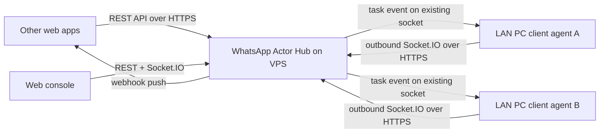

# WhatsApp Actor Hub

一个用于调度多台内网 WhatsApp client 的 actor hub。推荐部署方式是：Hub 放在公网 VPS，所有内网电脑上的 WhatsApp client agent 主动连出到 VPS Hub。VPS 不需要反向访问内网机器。

`whatsapp-web.js` 是 WhatsApp Web 的非官方 API，生产环境需要自行评估 WhatsApp 风控、封号、隐私和合规风险。

## 架构



## 功能

- 动态注册、删除、查看 WhatsApp clients。
- 根据在线状态调度指定 client 或随机在线 client。
- 发送消息任务状态：`queued`、`running`、`succeeded`、`failed`。
- client 收到消息后上报 hub，支持按 client、sender、chat 查询消息历史。
- 记录 API 请求历史，包括路径、状态码、来源 IP、耗时和脱敏后的请求体。
- Webhook 推送 `message.created` 和 `task.updated`。
- Web 中控实时查看 clients、tasks、messages、API requests，并手动发起发送任务。
- Web 中控使用登录页和 session cookie，支持多用户、角色和权限管理。

## 本地开发

```bash
cp .env.example .env
npm install
npm run dev
```

打开 `http://localhost:3000`，输入 `.env` 中的 `HUB_API_TOKEN`。

## VPS 部署

VPS 上建议用 Docker Compose 运行 Hub，并用 Nginx/Caddy/Traefik 提供 HTTPS 反向代理。公网入口请使用 HTTPS，因为 agent 会长期保持 Socket.IO 连接，业务系统也会通过公网 API 调度任务。

VPS 上的 `.env` 示例：

```bash
PORT=3000
DATABASE_PATH=./data/hub.sqlite
HUB_API_TOKEN=replace-with-a-long-random-token
WEB_ADMIN_USERNAME=admin
WEB_ADMIN_PASSWORD=replace-with-a-long-random-admin-password
PUBLIC_BASE_URL=https://hub.example.com
TRUST_PROXY=true
HOST_BIND_ADDRESS=127.0.0.1
HOST_PORT=3000
```

启动：

```bash
docker compose up -d --build
```

## GitHub Actions 自动部署

仓库已包含 `.github/workflows/deploy-vps.yml`。推送到 `main` 或手动运行 workflow 时，GitHub Actions 会打包项目，通过 SSH 上传到 VPS，然后执行 `docker compose up -d --build --remove-orphans`。

在 GitHub 仓库的 `Settings -> Secrets and variables -> Actions -> Repository secrets` 添加：

- `VPS_HOST`: VPS IP 或域名。
- `VPS_PORT`: SSH 端口，默认可填 `22`。
- `VPS_USER`: SSH 用户，例如 `root` 或 `deploy`。
- `VPS_SSH_PRIVATE_KEY`: GitHub Actions 用于登录 VPS 的私钥。
- `VPS_DEPLOY_PATH`: 部署目录，例如 `/opt/whatsapp-hub`。
- `VPS_ENV_FILE`: 生产环境 `.env` 的完整内容。

`VPS_ENV_FILE` 示例：

```bash
PORT=3000
DATABASE_PATH=./data/hub.sqlite
HUB_API_TOKEN=replace-with-a-long-random-token
WEB_ADMIN_USERNAME=admin
WEB_ADMIN_PASSWORD=replace-with-a-long-random-admin-password
PUBLIC_BASE_URL=https://hub.example.com
TRUST_PROXY=true
HOST_BIND_ADDRESS=127.0.0.1
HOST_PORT=3000
```

VPS 需要提前安装 Docker 和 Docker Compose，并允许上述 SSH 用户访问 Docker。首次部署前确认目录存在权限正常，或让 workflow 自动创建 `VPS_DEPLOY_PATH`。Actions 会把该 secret 写成 VPS 上的 `hub.env`，并只把 `HOST_BIND_ADDRESS`、`HOST_PORT`、`PORT` 提供给 Compose 做端口插值，因此 `HUB_API_TOKEN` 里可以包含 `$`。

VPS 镜像只安装 Hub 运行所需依赖，不安装 `whatsapp-web.js` 和 Puppeteer。内网电脑运行 agent 时使用普通 `npm install`，会安装这些 optional dependencies。

## Web 登录和权限

首次启动时，如果数据库里还没有用户，Hub 会使用环境变量创建初始管理员：

```bash
WEB_ADMIN_USERNAME=admin
WEB_ADMIN_PASSWORD=replace-with-a-long-random-admin-password
```

之后登录 `https://hub.example.com/login`，可以在 Web UI 的 User Management 面板里创建和删除用户。环境变量只用于首次初始化；已经创建用户后，修改环境变量不会覆盖数据库里的用户密码。

内置角色：

- `admin`: 查看所有数据、发送任务、删除 clients、管理 users。
- `operator`: 查看 clients/tasks/messages/API requests，并发送任务。
- `viewer`: 只读查看 clients/tasks/messages。

外部业务系统和内网 WhatsApp client agent 不使用 Web 用户登录，仍然使用 `HUB_API_TOKEN` 调用 `/api/*` 和连接 Socket.IO。

Nginx 反向代理示例，重点是保留 WebSocket upgrade：

```nginx
server {
  server_name hub.example.com;

  location / {
    proxy_pass http://127.0.0.1:3000;
    proxy_http_version 1.1;
    proxy_set_header Host $host;
    proxy_set_header X-Forwarded-For $proxy_add_x_forwarded_for;
    proxy_set_header X-Forwarded-Proto $scheme;
    proxy_set_header Upgrade $http_upgrade;
    proxy_set_header Connection "upgrade";
  }
}
```

## 内网 WhatsApp Client Agent

Agent 脚本位于 `agents/wwebjs-client/index.js`，通过 `npm run agent` 启动。每台运行 WhatsApp Web 的内网电脑都运行一个 agent。它只需要能访问 VPS 的 HTTPS 地址，不需要公网 IP，也不需要开放任何入站端口。

Agent 做的事情：

- 使用 `whatsapp-web.js` 启动 WhatsApp Web client。
- 首次运行在终端打印二维码，扫码后保存登录会话。
- 通过 Socket.IO 主动连接 VPS Hub。
- 向 Hub 注册 `CLIENT_ID`、名称、手机号和在线状态。
- 接收 Hub 下发的 `send-message` 任务。
- 把收到的 WhatsApp 消息、发送结果、任务失败原因回传到 Hub。

### 在内网电脑安装

内网电脑需要安装 Node.js LTS。然后获取本项目代码，可以直接 clone GitHub 仓库：

```bash
git clone https://github.com/samlau0086/whatsapp-hub.git
cd whatsapp-hub
npm install
```

如果只想部署 agent，也可以只复制这些文件和目录到内网电脑：

```text
package.json
agents/wwebjs-client/index.js
```

但推荐 clone 完整仓库，后续更新更方便。

### Agent 环境变量

在内网电脑的项目根目录创建 `.env`：

```bash
HUB_URL=https://ws.geekmt.com
CLIENT_ID=office-pc-01
CLIENT_NAME=Office PC 01
CLIENT_TOKEN=replace-with-the-same-value-as-HUB_API_TOKEN
PUPPETEER_HEADLESS=false
```

字段说明：

- `HUB_URL`: VPS Hub 公网地址，例如 `https://ws.geekmt.com`。
- `CLIENT_ID`: 当前内网电脑的唯一 ID。每台电脑必须不同，例如 `office-pc-01`、`store-pc-02`。
- `CLIENT_NAME`: Web 中控显示名称。
- `CLIENT_TOKEN`: 必须等于 VPS Hub 的 `HUB_API_TOKEN`。
- `PUPPETEER_HEADLESS`: 首次调试建议 `false`，稳定后可改为 `true`。

启动 agent：

```bash
npm run agent
```

首次运行会在终端显示二维码，用手机 WhatsApp 扫码登录。扫码成功后，Web 中控的 Clients 列表应看到该 `CLIENT_ID` 在线。

### Windows 持续运行

开发测试可以直接保持 PowerShell 窗口运行：

```powershell
cd C:\path\to\whatsapp-hub
npm run agent
```

生产环境建议使用进程管理器，例如 PM2：

```powershell
npm install -g pm2
pm2 start agents/wwebjs-client/index.js --name whatsapp-agent-office-pc-01
pm2 save
```

如果使用 PM2，请确保运行命令的目录里存在 `.env`，并且该 Windows 用户有权限保存 `whatsapp-web.js` 的登录会话目录。

### 测试连接

在内网电脑上先确认能访问 VPS Hub：

```bash
curl https://ws.geekmt.com/health
```

然后启动 agent。Hub Web 中控应该出现在线 client。也可以用 API 查看：

```bash
curl -H "x-hub-token: replace-with-the-same-value-as-HUB_API_TOKEN" https://ws.geekmt.com/api/clients
```

### 注意事项

- 每台内网电脑使用不同的 `CLIENT_ID`，否则后上线的连接会覆盖前一个同 ID client。
- 不要在 VPS 容器里运行 `npm run agent`。VPS 只运行 Hub，agent 应运行在实际登录 WhatsApp 的内网电脑上。
- 如果 WhatsApp 退出登录或二维码过期，重新运行 agent 并扫码。
- `whatsapp-web.js` 使用非官方 WhatsApp Web 接口，请控制发送频率，避免异常批量行为。

## API

所有 `/api/*` 请求都面向外部业务系统和 WhatsApp client agent，需要携带：

```http
x-hub-token: replace-with-a-long-random-token
```

示例中的域名请替换为你的 Hub 地址，例如 `https://ws.geekmt.com`。

### 创建发送任务

请求：

```bash
curl -X POST https://hub.example.com/api/tasks/send-message \
  -H "content-type: application/json" \
  -H "x-hub-token: replace-with-a-long-random-token" \
  -d "{\"to\":\"15551234567\",\"body\":\"hello from hub\",\"metadata\":{\"source\":\"crm\"}}"
```

调度规则：

- 如果目标手机号之前已有成功的 outbound 发送记录，优先使用上次给该手机号发送消息的 client。
- 如果该历史 client 当前离线，任务会保持 `queued`，等该 client 上线后自动发送。
- 如果没有历史 client，才使用请求里的 `clientId`。
- 如果没有历史 client 且没有传 `clientId`，随机选择一个在线 client。
- Web 后台或 API 可以手动把 queued 任务改派给其他 client。

```json
{
  "clientId": "office-pc-01",
  "to": "15551234567",
  "body": "hello from hub",
  "metadata": {
    "source": "crm"
  }
}
```

响应 `202 Accepted`：

```json
{
  "task": {
    "id": "9c52421c-7c6c-46c6-b88a-25f4d3aa8a52",
    "type": "send-message",
    "status": "running",
    "client_id": "office-pc-01",
    "target_phone": "15551234567",
    "payload": {
      "to": "15551234567",
      "body": "hello from hub",
      "metadata": {
        "source": "crm"
      }
    },
    "result": null,
    "error": null,
    "created_at": "2026-05-24T10:00:00.000Z",
    "updated_at": "2026-05-24T10:00:00.100Z",
    "completed_at": null
  }
}
```

如果命中历史 client 但该 client 离线，响应里的任务会是 `queued`：

```json
{
  "task": {
    "id": "7a4926da-26bb-4f90-8d1c-3f3ad84b6db4",
    "type": "send-message",
    "status": "queued",
    "client_id": "office-pc-01",
    "target_phone": "15551234567",
    "payload": {
      "to": "15551234567",
      "body": "hello from hub",
      "metadata": {},
      "routing": {
        "reason": "sticky-target-client",
        "requestedClientId": null,
        "stickyClientId": "office-pc-01"
      }
    },
    "result": null,
    "error": "waiting for client office-pc-01 to come online",
    "created_at": "2026-05-24T10:00:00.000Z",
    "updated_at": "2026-05-24T10:00:00.100Z",
    "completed_at": null
  }
}
```

常见错误：

```json
{
  "error": "no online clients available"
}
```

### 查询 clients

请求：

```bash
curl -H "x-hub-token: replace-with-a-long-random-token" https://hub.example.com/api/clients
```

响应：

```json
{
  "clients": [
    {
      "id": "office-pc-01",
      "name": "Office PC 01",
      "phone": "15551234567",
      "status": "online",
      "metadata": {
        "platform": "whatsapp-web.js",
        "pushname": "Sales"
      },
      "created_at": "2026-05-24T09:50:00.000Z",
      "updated_at": "2026-05-24T10:00:15.000Z",
      "last_seen_at": "2026-05-24T10:00:15.000Z"
    }
  ]
}
```

查询单个 client：

```bash
curl -H "x-hub-token: replace-with-a-long-random-token" https://hub.example.com/api/clients/office-pc-01
```

响应：

```json
{
  "client": {
    "id": "office-pc-01",
    "name": "Office PC 01",
    "phone": "15551234567",
    "status": "online",
    "metadata": {
      "platform": "whatsapp-web.js"
    },
    "created_at": "2026-05-24T09:50:00.000Z",
    "updated_at": "2026-05-24T10:00:15.000Z",
    "last_seen_at": "2026-05-24T10:00:15.000Z"
  }
}
```

### 查询任务

请求：

```bash
curl -H "x-hub-token: replace-with-a-long-random-token" https://hub.example.com/api/tasks
curl -H "x-hub-token: replace-with-a-long-random-token" https://hub.example.com/api/tasks/<task-id>
```

支持查询参数：

- `clientId`: 只看某个 client 的任务。
- `status`: 只看某个状态，例如 `running`、`succeeded`、`failed`。
- `limit`: 返回数量，最大 500。

列表响应：

```json
{
  "tasks": [
    {
      "id": "9c52421c-7c6c-46c6-b88a-25f4d3aa8a52",
      "type": "send-message",
      "status": "succeeded",
      "client_id": "office-pc-01",
      "target_phone": "15551234567",
      "payload": {
        "to": "15551234567",
        "body": "hello from hub",
        "metadata": {
          "source": "crm"
        }
      },
      "result": {
        "messageId": "true_15551234567@c.us_ABCDEF",
        "chatId": "15551234567@c.us"
      },
      "error": null,
      "created_at": "2026-05-24T10:00:00.000Z",
      "updated_at": "2026-05-24T10:00:03.000Z",
      "completed_at": "2026-05-24T10:00:03.000Z"
    }
  ]
}
```

单条响应：

```json
{
  "task": {
    "id": "9c52421c-7c6c-46c6-b88a-25f4d3aa8a52",
    "type": "send-message",
    "status": "succeeded",
    "client_id": "office-pc-01",
    "target_phone": "15551234567",
    "payload": {
      "to": "15551234567",
      "body": "hello from hub",
      "metadata": {}
    },
    "result": {
      "messageId": "true_15551234567@c.us_ABCDEF",
      "chatId": "15551234567@c.us"
    },
    "error": null,
    "created_at": "2026-05-24T10:00:00.000Z",
    "updated_at": "2026-05-24T10:00:03.000Z",
    "completed_at": "2026-05-24T10:00:03.000Z"
  }
}
```

### 查询消息

请求：

```bash
curl -H "x-hub-token: replace-with-a-long-random-token" "https://hub.example.com/api/messages?clientId=office-pc-01&limit=100"
curl -H "x-hub-token: replace-with-a-long-random-token" "https://hub.example.com/api/messages?targetPhone=15551234567&limit=100"
curl -H "x-hub-token: replace-with-a-long-random-token" "https://hub.example.com/api/clients/office-pc-01/messages"
```

支持查询参数：

- `clientId`: client ID。
- `targetPhone`: 目标手机号，会匹配 `sender`、`recipient` 和 `chat_id`。
- `sender`: 发件人。
- `chatId`: WhatsApp chat ID。
- `limit`: 返回数量，最大 500。

响应：

```json
{
  "messages": [
    {
      "id": "8f2fd5ed-0928-4ef9-9f57-57cb7fb359d1",
      "external_id": "false_15557654321@c.us_123456",
      "client_id": "office-pc-01",
      "direction": "inbound",
      "chat_id": "15557654321@c.us",
      "sender": "15557654321@c.us",
      "recipient": "15551234567@c.us",
      "body": "hi",
      "message_type": "chat",
      "payload": {
        "from": "15557654321@c.us",
        "to": "15551234567@c.us",
        "hasMedia": false,
        "type": "chat"
      },
      "created_at": "2026-05-24T10:02:00.000Z",
      "received_at": "2026-05-24T10:02:01.000Z"
    }
  ]
}
```

### 手动改派任务

请求：

```bash
curl -X PATCH https://hub.example.com/api/tasks/7a4926da-26bb-4f90-8d1c-3f3ad84b6db4/assign \
  -H "content-type: application/json" \
  -H "x-hub-token: replace-with-a-long-random-token" \
  -d "{\"clientId\":\"backup-pc-01\"}"
```

响应：

```json
{
  "task": {
    "id": "7a4926da-26bb-4f90-8d1c-3f3ad84b6db4",
    "type": "send-message",
    "status": "running",
    "client_id": "backup-pc-01",
    "target_phone": "15551234567",
    "payload": {
      "to": "15551234567",
      "body": "hello from hub",
      "metadata": {}
    },
    "result": null,
    "error": null,
    "created_at": "2026-05-24T10:00:00.000Z",
    "updated_at": "2026-05-24T10:03:00.000Z",
    "completed_at": null
  }
}
```

### 查询 API 请求记录

请求：

```bash
curl -H "x-hub-token: replace-with-a-long-random-token" "https://hub.example.com/api/requests?limit=100"
curl -H "x-hub-token: replace-with-a-long-random-token" "https://hub.example.com/api/requests?statusCode=500"
```

响应：

```json
{
  "requests": [
    {
      "id": "cce7b6ad-42c5-4dd3-912f-830f7a7517d1",
      "method": "POST",
      "path": "/api/tasks/send-message",
      "status_code": 202,
      "client_ip": "203.0.113.10",
      "user_agent": "curl/8.0.1",
      "request_body": {
        "to": "15551234567",
        "body": "hello from hub"
      },
      "response_time_ms": 18,
      "created_at": "2026-05-24T10:00:00.000Z"
    }
  ]
}
```

### 注册 webhook

请求：

```bash
curl -X POST https://hub.example.com/api/webhooks \
  -H "content-type: application/json" \
  -H "x-hub-token: replace-with-a-long-random-token" \
  -d "{\"url\":\"https://example.com/whatsapp-events\",\"events\":[\"message.created\",\"task.updated\"],\"secret\":\"shared-secret\"}"
```

响应：

```json
{
  "webhook": {
    "id": "5b9c2e53-94d4-4477-9f4d-f68765478204",
    "url": "https://example.com/whatsapp-events",
    "events": [
      "message.created",
      "task.updated"
    ],
    "secret": "shared-secret",
    "enabled": true,
    "created_at": "2026-05-24T10:05:00.000Z",
    "updated_at": "2026-05-24T10:05:00.000Z"
  }
}
```

查询 webhook：

```bash
curl -H "x-hub-token: replace-with-a-long-random-token" https://hub.example.com/api/webhooks
```

响应：

```json
{
  "webhooks": [
    {
      "id": "5b9c2e53-94d4-4477-9f4d-f68765478204",
      "url": "https://example.com/whatsapp-events",
      "events": [
        "message.created",
        "task.updated"
      ],
      "secret": "shared-secret",
      "enabled": true,
      "created_at": "2026-05-24T10:05:00.000Z",
      "updated_at": "2026-05-24T10:05:00.000Z"
    }
  ]
}
```

删除 webhook：

```bash
curl -X DELETE \
  -H "x-hub-token: replace-with-a-long-random-token" \
  https://hub.example.com/api/webhooks/5b9c2e53-94d4-4477-9f4d-f68765478204
```

响应：

```json
{
  "ok": true
}
```

## 关键环境变量

Hub:

- `PORT`: 容器内 Hub 端口，默认 `3000`。
- `HOST_BIND_ADDRESS`: VPS 绑定地址。使用 Nginx 反代时建议 `127.0.0.1`。
- `HOST_PORT`: VPS 绑定端口。如果 `3000` 已被占用，可以改成 `3001`，并让 Nginx 反代到对应端口。
- `DATABASE_PATH`: SQLite 文件位置，默认 `./data/hub.sqlite`。
- `HUB_API_TOKEN`: API 和 Socket.IO 认证 token。
- `WEB_ADMIN_USERNAME`: 首次初始化 Web 管理员用户名。
- `WEB_ADMIN_PASSWORD`: 首次初始化 Web 管理员密码。
- `PUBLIC_BASE_URL`: Hub 对外访问地址，例如 `https://hub.example.com`。
- `TRUST_PROXY`: 使用 Nginx/Caddy 等反向代理时设为 `true`。
- `CLIENT_OFFLINE_AFTER_MS`: 心跳超时后标记离线，默认 45 秒。

Agent:

- `HUB_URL`: VPS Hub 地址，例如 `https://hub.example.com`。
- `CLIENT_ID`: client 唯一 ID。
- `CLIENT_NAME`: 中控显示名称。
- `CLIENT_TOKEN`: 连接 hub 的 token，应与 `HUB_API_TOKEN` 一致。
- `PUPPETEER_HEADLESS`: 是否无头运行 Chromium。

## 后续可扩展点

- 将 SQLite 替换为 Postgres/MySQL，并加入多 hub 实例共享状态。
- 为不同业务系统和 client 增加独立 API key、权限范围、限流和审计。
- 支持媒体消息下载、对象存储、消息去重和重试队列。
- 增加任务优先级、按手机号绑定固定 client、失败自动切换 client。
- Webhook 使用 HMAC 签名替代当前简单 shared secret header。
